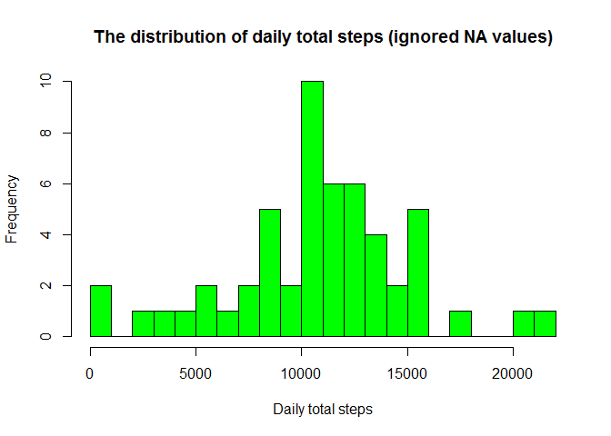
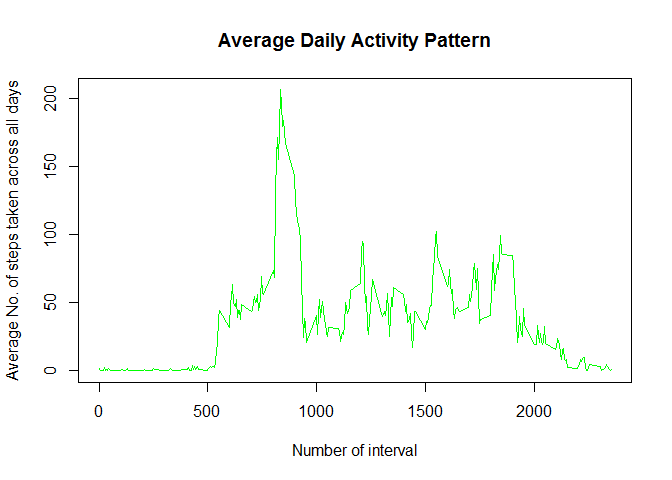
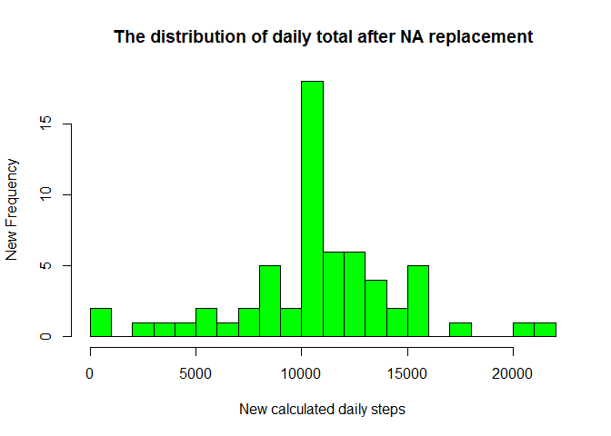
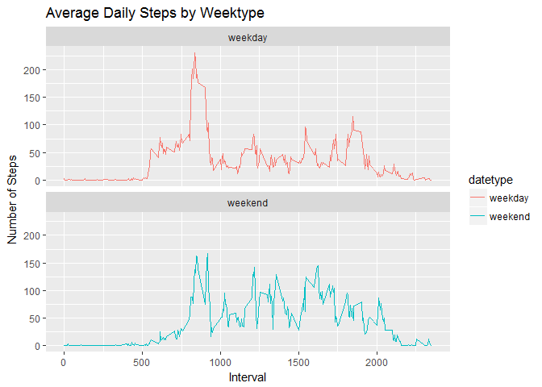

# Reproducible Research: Peer Assessment 1


## Loading and preprocessing the data
Loading data into environment :

```r
setwd("C:/workspace/R training/RepData_PeerAssessment1-1")
dataset <- read.csv("activity.csv", head = TRUE, na.strings = "NA")
summary(dataset)
```

```
##      steps                date          interval     
##  Min.   :  0.00   2012-10-01:  288   Min.   :   0.0  
##  1st Qu.:  0.00   2012-10-02:  288   1st Qu.: 588.8  
##  Median :  0.00   2012-10-03:  288   Median :1177.5  
##  Mean   : 37.38   2012-10-04:  288   Mean   :1177.5  
##  3rd Qu.: 12.00   2012-10-05:  288   3rd Qu.:1766.2  
##  Max.   :806.00   2012-10-06:  288   Max.   :2355.0  
##  NA's   :2304     (Other)   :15840
```

```r
max(dataset$interval)
```

```
## [1] 2355
```
Proocessing the data: changing data formats into usable formats and cutting out missing values

```r
dataset$date <- as.Date(strptime(dataset$date, format = "%Y-%m-%d"))
dataset$steps <- as.integer(dataset$steps)
dataset$interval <- as.integer(dataset$interval)
datasetclean <- subset(dataset, !is.na(dataset$steps))
```

## What is mean total number of steps taken per day?
### I will show this in two ways:
1. Calculating the mean and the median of the total number of steps taken per day

```r
daily <- tapply(datasetclean$steps, datasetclean$date, sum, na.rm = TRUE, simplify = TRUE)
day <- daily[!is.na(daily)]
mean(day)
```

```
## [1] 10766.19
```

```r
median(day)
```

```
## [1] 10765
```
As we can see above the mean of the total spes taken a day is 10766 steps and median value for this metric is 10765 steps.

2. Plotting a histogram to see a distribution of this characteristic


```r
hist(x=day,
     col="green",
     breaks=25,
     xlab="Daily total steps",
     ylab="Frequency",
     main="The distribution of daily total steps (ignored NA values)")
```

<!-- -->

The histogram shows the distribution of total steps taken in a day

## What is the average daily activity pattern?

As we can see in the data, the number of steps is split in 5 minutes interval, so to show the pattern of the daily activity we will make a plot of the average activity in a 5 minutes interval. I care to mention that i will mediate the average across all the days for the same interval.


```r
intervalaverage <- tapply(datasetclean$steps,datasetclean$interval, mean, na.rm = TRUE, simplify = TRUE)
dataintavg <- data.frame(interval = as.integer(names(intervalaverage)), avg = intervalaverage)
with(dataintavg,
     plot(interval, avg, type = "l",col = "green", main = "Average Daily Activity Pattern", xlab = "Number of interval", ylab = "Average No. of steps taken across all days"))
```

<!-- -->

It's to be observed that the maximum is reached somewhwre between 700-100 interval, that meaning between 11 am and 5 pm. To have a clear understanding of that, lets see exactly where the maximum lays:


```r
maxsteps <- max(dataintavg$avg)
dataintavg[dataintavg$avg == maxsteps,]
```

```
##     interval      avg
## 835      835 206.1698
```
## Imputing missing values

First of all we have to find out the number of missing values :

```r
sum(is.na(dataset$steps))
```

```
## [1] 2304
```

We see that there are 2304 missing values. Our interest in filling those missing values is to not disturb or chenge the distribution of the data and the characteristics of the dataset, so we will do this: we will fill the missing values with the mean values for those time intervals. For this we will create a dataset named : "datasetfilled" in which the missing values will be replaced.


```r
datasetfilled <- dataset
index <- is.na(datasetfilled$steps)
dataintavg <- tapply(datasetclean$steps, datasetclean$interval, mean, na.rm = TRUE, simplify = TRUE)
datasetfilled$steps[index] <- dataintavg[as.character(datasetfilled$interval[index])]
```

To see if any changes occurs let's remake the steps did before: histogram and mean/median calculus.


```r
newday <- tapply(datasetfilled$steps, datasetfilled$date, sum, na.rm = TRUE, simplify = TRUE)
hist(x=newday, col = "green", breaks = 25, xlab = "New calculated daily steps", ylab = "New Frequency", main = "The distribution of daily total after NA replacement")
```

<!-- -->

```r
mean(newday)
```

```
## [1] 10766.19
```

```r
median(newday)
```

```
## [1] 10766.19
```

TO be observed: The median changed to 10766 but that is easy to understand because completing the missing values with means for that specific interval conducts the median to be closer to the mean. Another consequence would be the increase in frequency for the values in the middle of the interval(center region) which are closer to the mean.

## Are there differences in activity patterns between weekdays and weekends?

A first step to take would be too create another column in the dataset which to say if the day is weeekday or weekend. We can do this by creating a function which takes as input the day and this classification or we can do it manually.


```r
datasetfilled$datetype <- ifelse(weekdays(as.Date(datasetfilled$date, tz = "UTC")) == "sâmbătă" | weekdays(as.Date(datasetfilled$date)) == "duminică", "weekend","weekday")
```

Now we have to compare the activity patterns so we will create a panel in which to figure the patterns for weekend and weekdays activity


```r
library(ggplot2)
activitybydate <- aggregate(steps ~ interval + datetype, datasetfilled, mean, na.rm = TRUE)
plot<- ggplot(activitybydate, aes(x =interval , y=steps, color=datetype)) +
       geom_line() +
       labs(title = "Average Daily Steps by Weektype", x = "Interval", y = "Number of Steps") +
       facet_wrap(~datetype, ncol = 1, nrow=2)
print(plot)
```

<!-- -->
